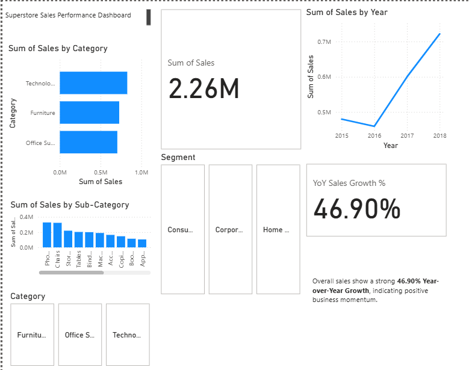

Superstore Sales Performance Dashboard
Project Overview
This project involved building an interactive Business Intelligence (BI) dashboard to analyze sales performance using a retail dataset. The primary goal was to identify key sales trends, top-performing product categories, and customer segments to provide actionable insights for strategic business decisions. This project demonstrates an end-to-end data analysis workflow, from raw data preparation to interactive visualization and strategic recommendations.

Data Source
The analysis was performed on the train.csv dataset, which simulates transactional sales data for a retail superstore. The dataset includes details such as Order ID, Order Date, Product Category, Sub-Category, Sales, and Customer information.

Methodology
The project followed a structured approach, leveraging powerful tools for data preparation and visualization:

1. Data Preparation with Python (Pandas)
Data Ingestion & Cleaning: Utilized Python with the pandas library to read the raw train.csv data.

Date Transformation: Converted the 'Order Date' column to a proper datetime format, correctly handling the DD/MM/YYYY format (dayfirst=True) to ensure accurate time-series analysis.

Data Filtering: Filtered the dataset to focus exclusively on sales orders from 2017 onwards. This step simulates a common real-world scenario of extracting specific subsets of data from a larger raw source (analogous to using a WHERE clause in SQL).

Column Selection: Selected and refined the most relevant columns, creating a clean dataset (Store_Sales_Cleaned_for_PowerBI.csv) optimized for visualization.

2. Interactive Dashboard Development in Power BI
Data Loading: Loaded the pre-processed Store_Sales_Cleaned_for_PowerBI.csv into Microsoft Power BI Desktop.

Key Performance Indicators (KPIs): Developed prominent card visuals to display crucial metrics, including:

Total Sales: 2.26 Million

Year-over-Year (YoY) Sales Growth %: Calculated using DAX (Data Analysis Expressions) to dynamically calculate the percentage growth compared to the previous year, showing 46.90% growth. This highlights advanced analytical capabilities.

Core Visualizations: Designed and implemented various interactive charts for in-depth analysis:

Sales by Category Bar Chart: To identify top-performing product categories (e.g., Technology, Furniture, Office Supplies).

Sales by Sub-Category Bar Chart: Providing a granular view of product performance.

Sales Trend by Year Line Chart: Visualizing sales performance over time, with drill-down capabilities enabled to explore trends by month.

Interactive Slicers: Incorporated dynamic slicers to allow users to filter the entire dashboard by:

Customer Segment (e.g., Consumer, Corporate)

Product Category

Dashboard Layout & Polish: Arranged all visuals and text elements for a clean, intuitive, and professional user experience, ensuring clarity and readability.

Key Insights & Business Recommendations
Based on the analysis presented in the dashboard, the following key insights and recommendations were derived:

Key Insights
Overall sales show a strong 46.90% Year-over-Year Growth, indicating positive business momentum.

Technology and Office Supplies consistently lead as top-performing product categories by sales.

Sales exhibit clear seasonal patterns, with peak performance typically observed towards the end of each year.

The Consumer segment contributes the largest portion of overall sales compared to other customer segments.

Recommendations
Invest further in marketing and inventory for high-performing categories like Technology and Office Supplies to maximize profitability.

Analyze historical peak season strategies to optimize promotional campaigns and resource allocation for future periods.

Develop targeted customer engagement strategies for the Consumer segment to maintain and grow market share.

Tools Used
Python (with Pandas library for data preparation)

Microsoft Power BI Desktop (for data modeling, DAX, and interactive dashboard development)

GitHub (for version control and project hosting)

